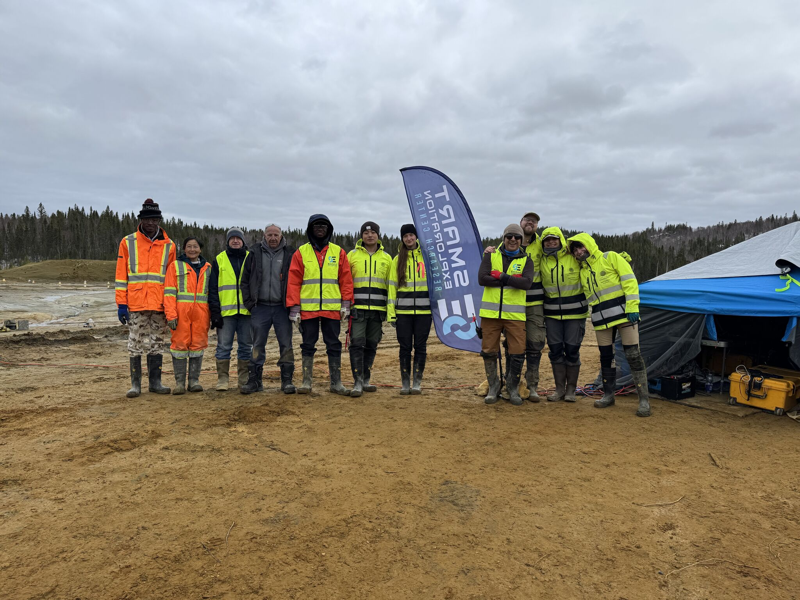
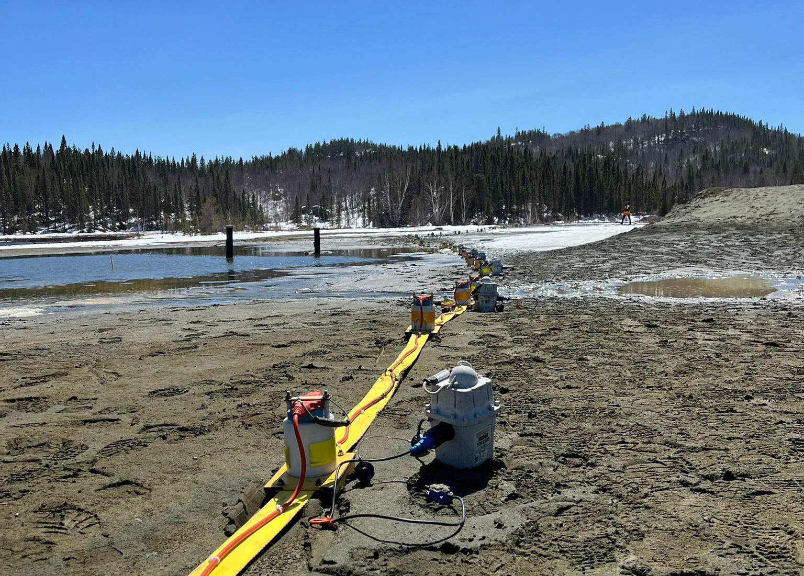
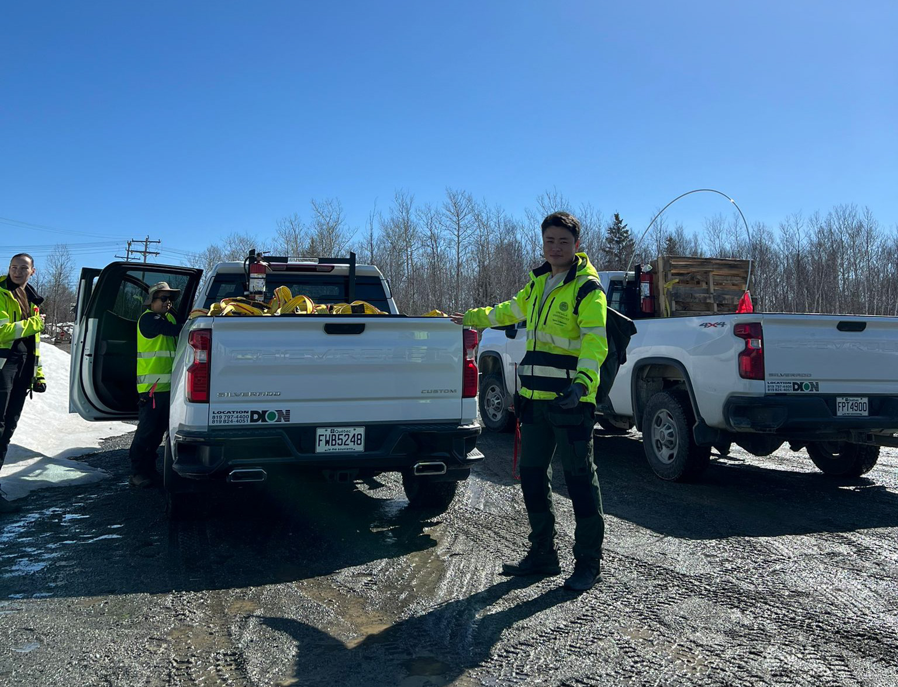
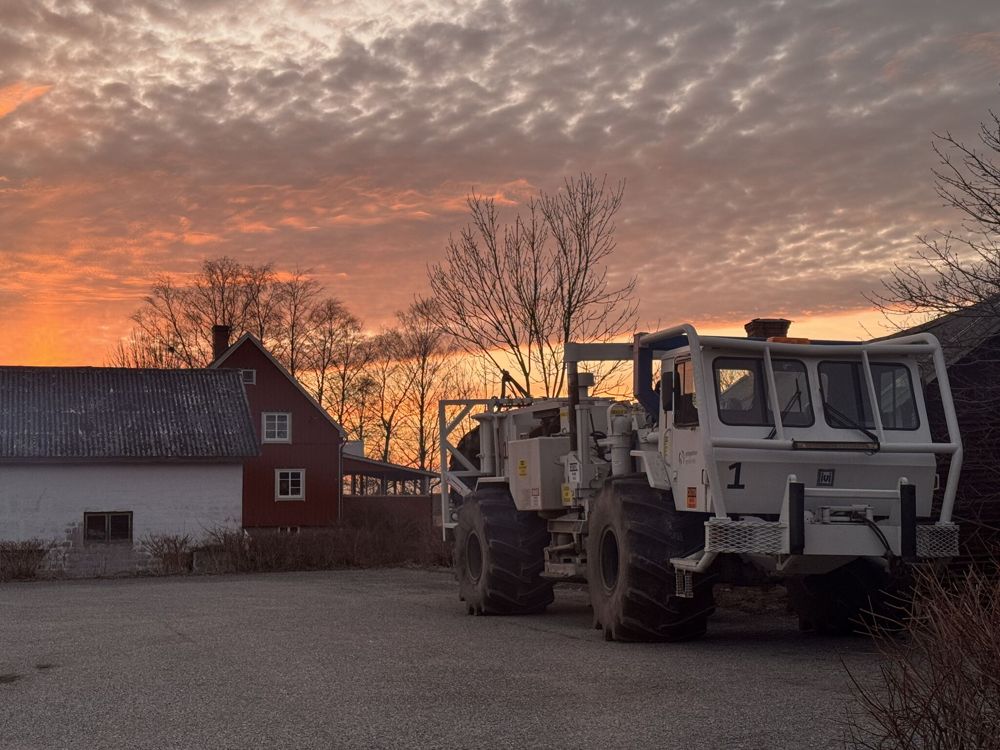
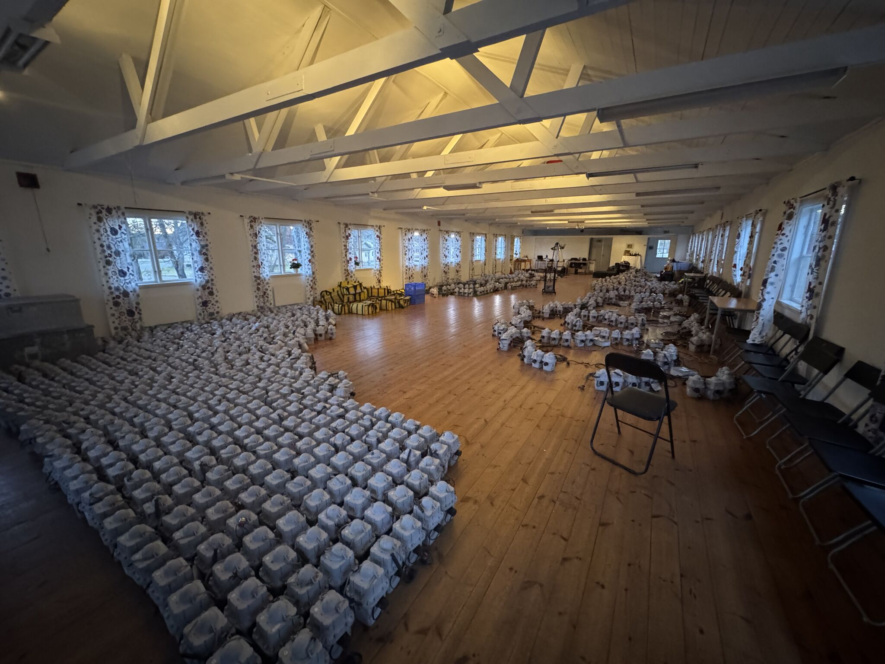
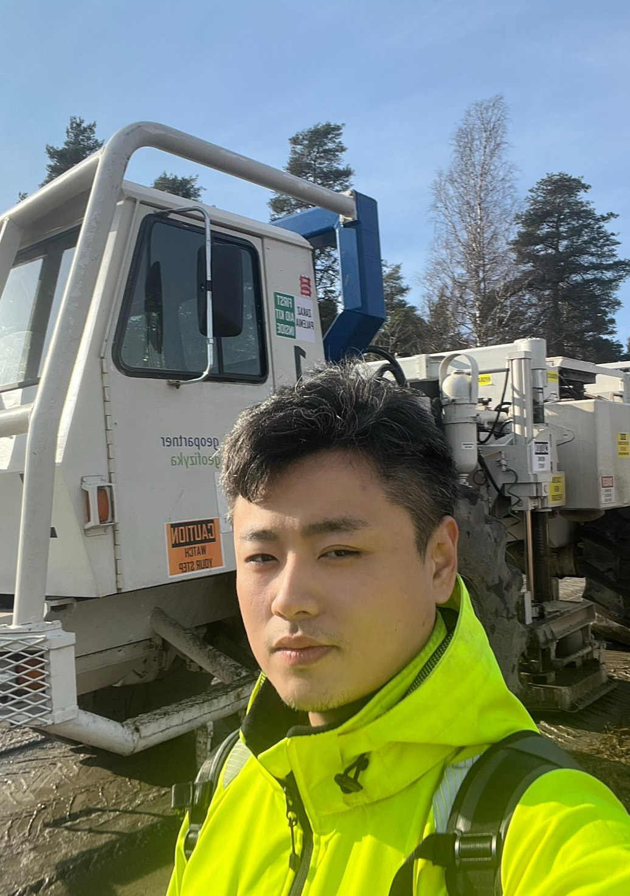
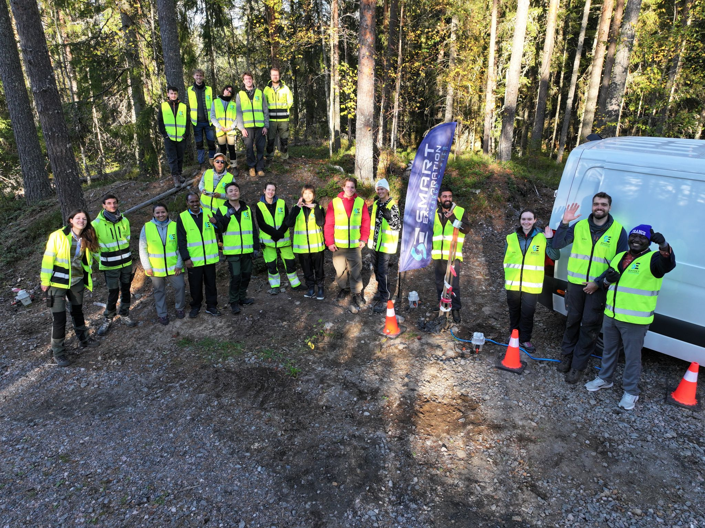
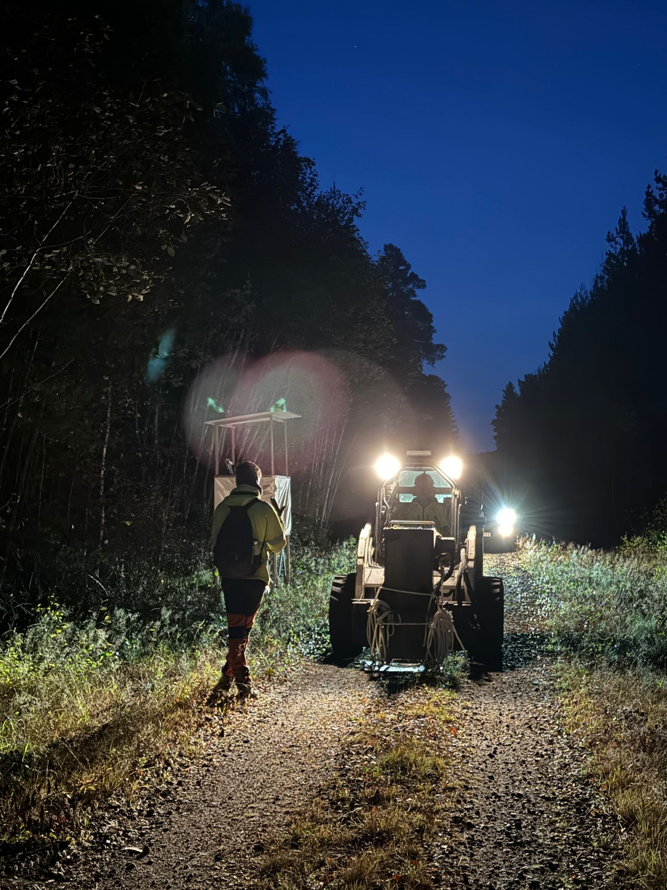
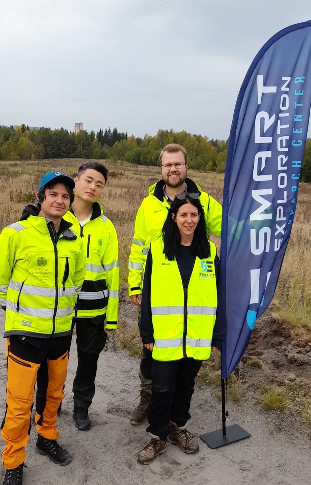

## Hi there 👋

I am currently a Postdoctoral Researcher at [Uppsala University](https://www.uu.se/en), as part of the [Smart Exploration Research Center (SERC)](https://www.smartexploration.se/early-career-professionals/), contributing to research on AI for geophysical sciences. If you are interested in academic cooperation, please feel free to contact me at [yanglq199301@gmail.com](mailto:yanglq199301@gmail.com).

I graduated from the College of Geophysics, China University of Petroleum (Beijing), with a Ph.D. in Geological Resources and Geological Engineering. 

### Research Interests
- AI for Geophysical Sciences
- Seismic Data Processing and Imaging
- Reservoir Characterization
- Geophysical Inversion
- Interpretable and Reliable AI

### 📎 Homepages
- Personal Pages: https://YangLiuqing-add.github.io (updated recently🔥)
- LinkedIn: https://www.linkedin.com/in/liuqing-yang-b94501302/?skipRedirect=true
- Google Scholar: https://scholar.google.com/citations?user=-IY0AbUAAAAJ&hl=en
- ResearchGate: https://www.researchgate.net/profile/Liuqing-Yang-22?ev=hdr_xprf

### 🔥 News
- *2026.06*: 🎉 Gave an oral presentation at the 87th EAGE Annual Conference
- *2026.01*: 🎉 One paper is published in Geophysical Prospecting
- *2025.09*: 🎉 One paper is published in Seismological Research Letters
- *2025.05*: 🎉 One paper is published in JGR: MLC
- *2025.01*: 🎉 One paper is published in Geophysics

### 🌍 Field Activities
#### 🇨🇦 Vauze Mine Tailings Facility, Quebec, Canada
Participated in a large-scale 3D seismic and DAS acquisition campaign for mine tailings characterization and stability assessment, involving wireless seismic recorders, landstreamer-based surveys, and DAS measurements.

  
  
  

#### 🇸🇪 Mineral Exploration Survey, Sala, Sweden
Participated in a mixed 2D and sparse 3D seismic acquisition campaign over 30 km in the Sala region, together with collocated MT measurements, to image deep geological structures and support mineral exploration in central Sweden.

  
  
  

<!--
#### 🇸🇪 Blötberget Mine Tailings Facility, Ludvika, Sweden

Participated in a full-scale geophysical survey involving fiber-optic cable deployment, DAS measurements, and 3D seismic acquisition at the historical Nordic Iron mine tailings facility in the Blötberget area, supporting subsurface characterization and mineral exploration.

  
  
  

-->

### 💻 Selected Research Papers

My full paper list is shown at [my personal homepage](https://YangLiuqing-add.github.io).

#### 🎙 Seismic Processing and Interpretation
- ``JGR: MLC 2025`` [Enhanced Hardrock Seismic Imaging Through Multi‐Scale Information‐Guided Unsupervised Learning](https://arxiv.org/abs/2006.04558), **Liuqing Yang**, Alireza Malehmir, Magdalena Markovic.
- ``IEEE TGRS 2024`` [Salt3DNet: A Self-Supervised Learning Framework for 3D Salt Segmentation](https://doi.org/10.1109/TGRS.2024.3394592), **Liuqing Yang**, Sergey Fomel, Yangkang Chen, et al.
- ``Surveys in Geophysics 2024`` [Deep Learning with Fully Convolutional and Dense Connection Framework for Ground Roll Attenuation](https://doi.org/10.1007/s10712-023-09779-8), **Liuqing Yang**, Shoudong Wang, Yangkang Chen, et al.
- ``Geophysics 2023`` [Denoising of distributed acoustic sensing (DAS) data using supervised deep learning](https://doi.org/10.1190/geo2022-0138.1), **Liuqing Yang**, Sergey Fomel, Yangkang Chen, et al.
#### 👄 Geophysical Inversion
- ``GP 2026`` [Unsupervised Physics‐Guided Deconvolution for High‐Resolution Hardrock Seismic Imaging](https://doi.org/10.1111/1365-2478.70123), **Liuqing Yang**, Alireza Malehmir, Magdalena Markovic.
- ``Geophysics 2025`` [HCTNet: Robust Prestack Seismic Inversion using a Hybrid Convolutional Transformer](https://doi.org/10.1190/geo2024-0015.1), **Liuqing Yang**, Sergey Fomel, Yangkang Chen, et al.

#### 📚 Reservoir Characterization
- ``Geophysics 2023`` [Porosity and permeability prediction using transformer and periodic long short-term network](https://doi.org/10.1190/geo2022-0150.1), **Liuqing Yang**, Sergey Fomel, Yangkang Chen, et al.
- ``IEEE TNNLS 2022`` [High-Fidelity Permeability and Porosity Prediction Using Deep Learning With the Self-Attention Mechanism](https://doi.org/10.1109/TNNLS.2022.3157765), **Liuqing Yang**, Sergey Fomel, Yangkang Chen, et al.

#### 🎼 AI for Seismology
- ``SRL 2025`` [QBTransNet: Deep Learning Earthquake Distinction from Quarry Blasts Using Dilated Convolutional Transformer](https://doi.org/10.1785/0220240388), **Liuqing Yang**, Yangkang Chen, Alexandros Savvaidis, et al.
- ``GJI 2025`` [Rapid identification of induced seismicity using deep learning in West Texas](https://doi.org/10.1785/0220240388), Yangkang Chen, Lason Grigoratos, **Liuqing Yang**, et al.

